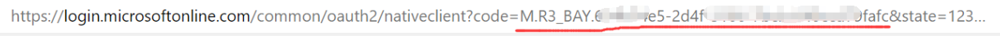

# 上海交通大学计算机系讲座通知

本项目周期性从[上交计算机系官网](https://cs.sjtu.edu.cn/NewNotice.aspx)获取最新的讲座信息，并将它同步到Microsoft To-Do APP. 通过此项目，研究生同学能够便捷地发现新讲座，~~完成培养计划的任务~~

## 前置条件

- docker
- docker compose
- 微软账号

## 获取Microsoft refresh_token

访问这个链接：

https://login.microsoftonline.com/consumers/oauth2/v2.0/authorize?client_id=94a2981b-fcac-4814-a1b0-039d043e70fd&response_type=code&redirect_uri=https%3A%2F%2Flogin.microsoftonline.com%2Fcommon%2Foauth2%2Fnativeclient&response_mode=query&scope=Tasks.ReadWrite%20User.Read%20offline_access&state=12345

对本应用（seminar-notify）授权后，观察地址栏：


将code参数的值复制下来，然后执行以下命令：

```bash
curl -d "client_id=94a2981b-fcac-4814-a1b0-039d043e70fd&scope=Tasks.ReadWrite%20User.Read%20offline_access&redirect_uri=https%3A%2F%2Flogin.microsoftonline.com%2Fcommon%2Foauth2%2Fnativeclient&grant_type=authorization_code&code=【上一步复制的code】" https://login.microsoftonline.com/consumers/oauth2/v2.0/token
```

你应该获得了一个json响应，将其中的`refresh_token`字段保存下来。

## 运行应用

将上一步保存的refresh_token（注意不是最开始的code）填入config.json文件内。同时可以修改里面的各项设置，每项设置的意义如下：

-  "refresh_token": 用于访问你的账户的授权，**将上一步的refresh_token填在这里**
-  "client_id": 本项目的id. 除非你希望去Azure注册一个自己的应用，否则不要修改
-  "list_name": 默认为"SJTU Seminars",是ToDo的列表标题，可以自定义
-  "update_period_min": 默认60，获取新讲座信息的周期。单位为分钟。

接下来，运行以下命令：

```bash
git clone https://github.com/xzcxzcyy/SJTU-CS-Seminar.git
cd SJTU-CS-Seminar/

docker-compose build
docker-compose up --detach

# docker服务启动需要一定时间。尽量等待30秒左右再执行下一步

curl -X POST 127.0.0.1:8000/start_timer #这一步用来启动定时器，周期性自动获取讲座
```

## HTTP API

在上一步中，我们使用curl向本机8000端口的/start_timer接口发送了POST请求。除此之外，程序还有若干接口。

### start_timer

启动定时器，将周期性获取新的讲座信息。

POST /start_timer

```bash
curl -X POST http://127.0.0.1:8000/start_timer
```

### update_seminars

进行一次手动更新，并将结果推送到ToDo APP

**当你需要验证程序是否正确执行时，可以调用这个接口进行一次手动更新**

POST /update_seminars

```bash
curl -X POST http://127.0.0.1:8000/update_seminars
```

### get_config

获取当前所有配置信息

GET /get_config

```bash
curl -X GET http://127.0.0.1:8000/get_config
```

### set_config

修改设置。请求体是json格式，可以在`config.json`的基础上修改，然后发送请求

POST /set_config

```bash
curl -X POST -H "Content-Type: application/json" -d @config.json http://127.0.0.1:8000/set_config
```

### clear

清除缓存。**当应用出现问题时，应首先考虑调用此接口，或者直接使用docker-compose重启服务**

POST /clear

```bash
curl -X POST http://127.0.0.1:8000/clear
```
